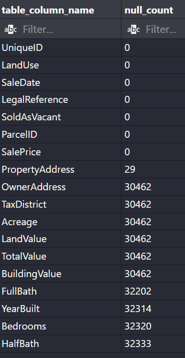
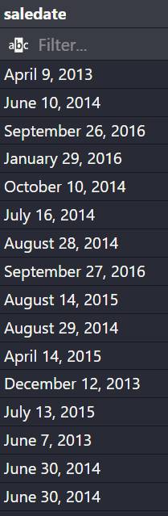
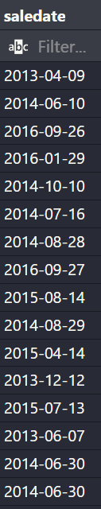
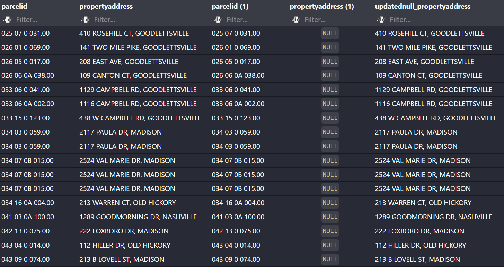
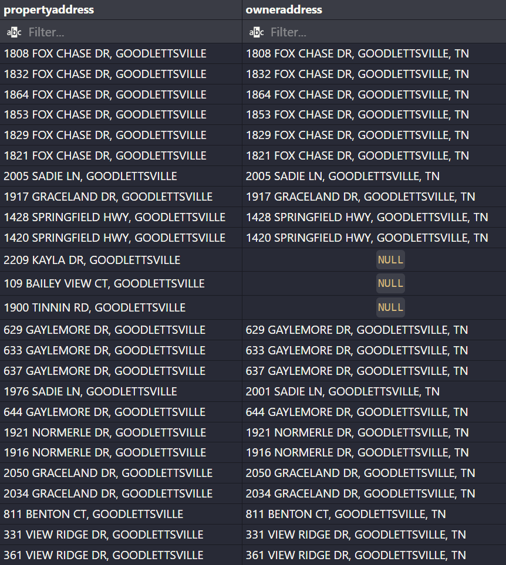
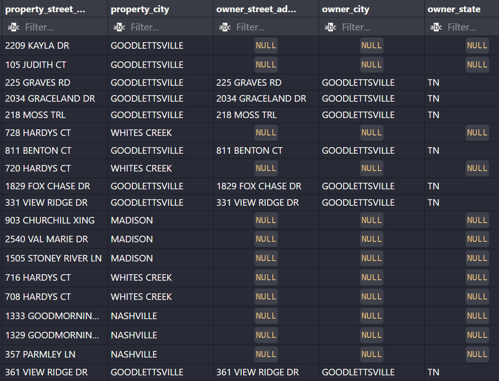
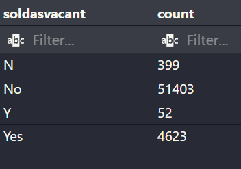
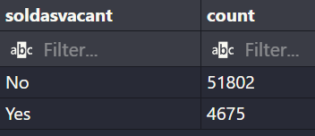
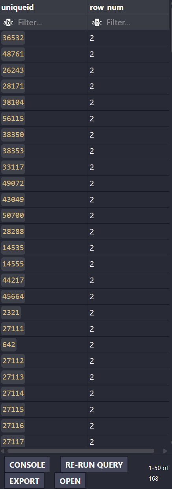
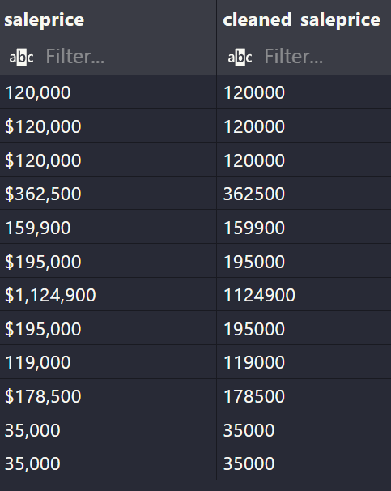

# Introduction
This project aims to showcase or demonstrate my thought process while cleaning dirty datasets.
- Database and tables were created solely from scratch though use of VSCode (Postgres connection)
- Datasets were provided from [Github: Alex The Analyst](https://github.com/AlexTheAnalyst/PortfolioProjects/blob/main/Nashville%20Housing%20Data%20for%20Data%20Cleaning.xlsx)
All the codes can be found inside this [SQL query folder](/SQL_cleaning/Nashville_housing_data/sql_queries/) 
    - For specifics:
        - How I created my [table](/SQL_cleaning/Nashville_housing_data/sql_queries/Creating_nashville_housing_data_raw.sql)
        - Cleaning process perform in a [single query](/SQL_cleaning/Nashville_housing_data/sql_queries/Cleaning_nashville_housing_data_raw.sql)
        - Cleaning process categorized into [individual query](/SQL_cleaning/Nashville_housing_data/sql_queries/Individual%20queries/)

# Background
The Nashville housing dataset primary domain focuses on real estate / housing.
Serving as a realistic example of the challenges encountered when working with raw data that consists of inconsistent formats, missing values, and possible duplicates.
Therefore the aim of this project will demonstrate my methods used to standardize data, imputations, deduplicate to ensure the data created is of high quality 
and integrity to be used for Exploratory data analysis.

# Tools used
1. **VScode** (Mainly for query as well as integrate with other languages/software)
2. **Postgres** (Main database created on this platform as well as sql version usage)
3. **Excel CSV files** (Raw and unaltered dataset in the event of unintended permanent changes to stage table)


# Cleaning process

## 1a) Explore and understand the table concept.
```sql
SELECT * 
FROM nashville_housing_data_raw;
```

## 1b) Checking for null values.
```sql
-- Overseeing nulls value, then identify easier addressable problems.
SELECT 'UniqueID' AS table_column_name, COUNT(*) - COUNT(UniqueID) AS null_count FROM nashville_housing_data_raw
UNION ALL
SELECT 'ParcelID', COUNT(*) - COUNT(ParcelID) FROM nashville_housing_data_raw
UNION ALL
SELECT 'LandUse', COUNT(*) - COUNT(LandUse) FROM nashville_housing_data_raw
UNION ALL
SELECT 'PropertyAddress', COUNT(*) - COUNT(PropertyAddress) FROM nashville_housing_data_raw
UNION ALL
SELECT 'SaleDate', COUNT(*) - COUNT(SaleDate) FROM nashville_housing_data_raw
UNION ALL
SELECT 'SalePrice', COUNT(*) - COUNT(SalePrice) FROM nashville_housing_data_raw
UNION ALL
SELECT 'LegalReference', COUNT(*) - COUNT(LegalReference) FROM nashville_housing_data_raw
UNION ALL
SELECT 'SoldAsVacant', COUNT(*) - COUNT(SoldAsVacant) FROM nashville_housing_data_raw
UNION ALL
SELECT 'OwnerAddress', COUNT(*) - COUNT(OwnerAddress) FROM nashville_housing_data_raw
UNION ALL
SELECT 'Acreage', COUNT(*) - COUNT(Acreage) FROM nashville_housing_data_raw
UNION ALL
SELECT 'TaxDistrict', COUNT(*) - COUNT(TaxDistrict) FROM nashville_housing_data_raw
UNION ALL
SELECT 'LandValue', COUNT(*) - COUNT(LandValue) FROM nashville_housing_data_raw
UNION ALL
SELECT 'BuildingValue', COUNT(*) - COUNT(BuildingValue) FROM nashville_housing_data_raw
UNION ALL
SELECT 'TotalValue', COUNT(*) - COUNT(TotalValue) FROM nashville_housing_data_raw
UNION ALL
SELECT 'YearBuilt', COUNT(*) - COUNT(YearBuilt) FROM nashville_housing_data_raw
UNION ALL
SELECT 'Bedrooms', COUNT(*) - COUNT(Bedrooms) FROM nashville_housing_data_raw
UNION ALL
SELECT 'FullBath', COUNT(*) - COUNT(FullBath) FROM nashville_housing_data_raw
UNION ALL
SELECT 'HalfBath', COUNT(*) - COUNT(HalfBath) FROM nashville_housing_data_raw
ORDER BY null_count;
```

### Null values across table summarized.


### Findings and thought process.
- 11/18 columns have nulls.
- Can I settle all the columns with the nulls? Which one is the easiest to address?
    - Since propertyaddress has the least amount of nulls, I can add this to list of priorities problem to clear.
- Before cleaning propertyaddress, let's take a look at other no-nulls columns since it's direct cleaning.
    - Cleaning nulls most likely involve imputations or checking duplicate fills.
    - Therefore let's eyeball on easier columns like standardizing formats such as saledate.


---
---
## 2) Standardize the format of saledate column.
```sql
-- Standardize saledate (Update Table as well)
SELECT
    TO_DATE(saledate, 'Month DD, YYYY') AS standardize_date
FROM
    nashville_housing_data_raw
LIMIT 100;

-- Update saledate column from TEXT into TYPE DATE
ALTER TABLE nashville_housing_data_raw
ALTER COLUMN saledate TYPE DATE
USING TO_DATE(saledate, 'Month DD, YYYY');
```

### saledate column **'before'** reformat


### saledate column **'after'** reformat


### Findings and thought process.
- The saledate column has incorrect data type called TEXT.
    - During Exploratory data analysis, we can't perform date functions involving this column.
- Unable to integrate properly into Data Visualization tools such as PowerBi or Tableau.
    - Text stores as alphabetical, date stores choronological.
    - Improper data type will result in unstability when reuse in tools as stated aforementioned.
- Casting saledate as DATE will instantly solve the problem above.
    - Better optimization for a faster query time.


---
---
## 3) Imputation on missing nulls within propertyaddress.
```sql
-- Perform inner join to fill missing nulls using coalesce to visualize before updating
SELECT 
    a.parcelid,
    a.propertyaddress,
    b.parcelid,
    b.propertyaddress,
    COALESCE(b.propertyaddress,a.propertyaddress) AS updatednull_propertyaddress
FROM 
    nashville_housing_data_raw AS a
INNER JOIN nashville_housing_data_raw AS b On 
    (a.parcelid = b.parcelid AND
    a.uniqueid <> b.uniqueid)
WHERE b.propertyaddress IS NULL;

-- Update propertyaddress column to fill up Null values
UPDATE nashville_housing_data_raw AS b
SET propertyaddress = a.propertyaddress
FROM 
    nashville_housing_data_raw AS a
WHERE 
    a.parcelid = b.parcelid AND
    a.uniqueid <> b.uniqueid AND
    b.propertyaddress IS NULL;
```

### Duplicates parceid allows for easy spotting and impute (Before update to serve as visualisation guide before updating)


### Findings and thought process.
- 29 missing nulls is possible to solve, method is to check for duplicates using same parceid & different uniqueid.
    - Each purchase have their personal uniqueid(can't replicate), but a parcelid can have multiple shared aparment complex.
    - Therefore, performing inner joins with the conditions above corellating with nulls allows for easier identification of the property address.


---
---
## 4) Splitting delimiters(comma) for propertyaddress and owneraddress
```sql
SELECT 
    propertyaddress,
    owneraddress
FROM 
    nashville_housing_data_raw;


-- Focusing on propertyaddress first
SELECT
    TRIM(SPLIT_PART(propertyaddress, ',', 1)) AS property_street_address,
    TRIM(SPLIT_PART(propertyaddress, ',', 2)) AS property_city
FROM nashville_housing_data_raw;


-- Use Begin before committing permanently, to allow checking for reassurance
BEGIN;

ALTER TABLE nashville_housing_data_raw
ADD COLUMN property_street_address VARCHAR(255),
ADD COLUMN property_city VARCHAR(255);

UPDATE nashville_housing_data_raw
SET property_street_address = TRIM(SPLIT_PART(propertyaddress, ',', 1)),
property_city = TRIM(SPLIT_PART(propertyaddress, ',', 2));

-- Checking table to see result is corrected as intended
SELECT *
FROM nashville_housing_data_raw;

COMMIT;


-- Focusing on owneraddress next.
SELECT
    TRIM(SPLIT_PART(owneraddress, ',', 1)) AS owner_street_address,
    TRIM(SPLIT_PART(owneraddress, ',', 2)) AS owner_city,
    TRIM(SPLIT_PART(owneraddress, ',', 3)) AS owner_state
FROM nashville_housing_data_raw;

-- Same concept as above
BEGIN;

ALTER TABLE nashville_housing_data_raw
ADD COLUMN owner_street_address VARCHAR(255),
ADD COLUMN owner_city VARCHAR(255),
ADD COLUMN owner_state VARCHAR(255);

UPDATE nashville_housing_data_raw
SET owner_street_address = TRIM(SPLIT_PART(owneraddress, ',', 1)),
owner_city = TRIM(SPLIT_PART(owneraddress, ',', 2)),
owner_state = TRIM(SPLIT_PART(owneraddress, ',', 3));

SELECT *
FROM nashville_housing_data_raw;

COMMIT;
```

### propertyaddress & owneraddress columns **'before'** reformat


### propertyaddress & owneraddress columns **'after'** reformat


### Findings and thought process.
- Trim and split by comma in partitions column street address, city, state.
    - To extract meaningful data to be used for further analysis.
    - Standardization of format, so aggregations are more accurate.
        - Counting properties per street or city for example.
        - Consistent comparison of multiple properties.
- Usage of Begin, Commit/Rollback gives us reassurance before accepting the final changes
    - Allows us to scan and check the result as intended.
    - If result is undesirable, we can always 'undo' by rollback anytime.


---
---
## 5) Standardizing variables in soldasvacant column
```sql
SELECT 
    DISTINCT(soldasvacant),
    COUNT (*) AS total,
    CASE
        WHEN TRIM(soldasvacant) = 'N' THEN 'No'
        WHEN TRIM(soldasvacant) = 'Y' THEN 'Yes'
        ELSE TRIM(soldasvacant)
    END AS cleaned_soldasvacant
FROM 
    nashville_housing_data_raw
GROUP BY
    soldasvacant
-- Before inserting CASE clause, my result displayed N:399, No:51403, Y:52, Yes:4623


BEGIN;

UPDATE nashville_housing_data_raw
SET soldasvacant = 
    CASE
        WHEN TRIM(soldasvacant) = 'N' THEN 'No'
        WHEN TRIM(soldasvacant) = 'Y' THEN 'Yes'
        ELSE TRIM(soldasvacant)
    END
;

SELECT 
    DISTINCT(soldasvacant),
    COUNT (*)
FROM 
    nashville_housing_data_raw
GROUP BY
    soldasvacant;
-- No:51802, Yes:4675

COMMIT;
```

### soldasvacant **'before'** standardization


### soldasvacant **'after'** standardization


### Findings and thought process.
- Taking the higher count as standard, 'Yes' and 'No'
    - I trim before assimilate the other variables as above accordingly using Case clause.
- Using Begin, Commit/Rollback reassures that the desired output has been attained before permanent update.


---
---
## 6) Removing duplicates across the table
```sql
WITH duplicates AS
(
    SELECT
        *,
        ROW_NUMBER() OVER(
            PARTITION BY parcelid, propertyaddress, saledate, saleprice
            ORDER BY uniqueid
        ) AS row_num
    FROM
        nashville_housing_data_raw
) 
SELECT
    uniqueid,
    row_num
FROM 
    duplicates AS d
WHERE
    row_num > 1;


BEGIN;

WITH duplicates AS(
    SELECT
        *,
        ROW_NUMBER() OVER(
            PARTITION BY parcelid, propertyaddress, saledate, SalePrice
            ORDER BY uniqueid
        ) AS row_num
    FROM
        nashville_housing_data_raw
) 

DELETE FROM nashville_housing_data_raw AS n
USING duplicates AS d
WHERE 
    n.uniqueid = d.uniqueid AND
    row_num > 1
RETURNING d.*;   -- to check what has been deleted.

COMMIT;
```

### soldasvacant **'after'** standardization


### Findings and thought process.
- Duplicate is a bit challenging, initially wanted to use inner join
    - However to compare against multiple column will be ambigous
- Decided to groupup by groups into super group, for every similar subgroup, count increase = duplicates
    - ROW_NUMBER() OVER(PARTITION BY...ORDER BY...) allows for summation of duplicates
    - RETURNING d.* is to ensure that I am deleting the necesary rows that are duplicate


---
---
## 7) Casting data types on all the remaining columns where necessary (Long query)
-- Before casting, visual inspection and format checks were executed first ensuring high integrity dataset.
```sql
-- 1) Checking on saleprice then cast
SELECT 
    saleprice,
    REGEXP_REPLACE(TRIM(saleprice), '[^0-9]', '', 'g') AS standardized_salesprice
FROM nashville_housing_data_raw
WHERE saleprice;
-- Returns back 12 rows with wrong format + another column that shows the aftermath of the reformat.
-- REGEXP_REPLACE(...) works here because dataset is in TEXT

BEGIN;

ALTER TABLE nashville_housing_data_raw
ALTER COLUMN saleprice TYPE INT
USING CASE
  WHEN regexp_replace(trim(saleprice), '[^0-9]', '', 'g') ~ '^[0-9]+$'
    THEN regexp_replace(trim(saleprice), '[^0-9]', '', 'g')::INT
  ELSE NULL
END;

-- To check if above standardization works correctly
SELECT
    COUNT(*) as failed_conversion
FROM
    nashville_housing_data_raw
WHERE
    saleprice IS NULL;
-- return count = 0

COMMIT;
```
### saleprice **'before and after'** reformat


---
---
```sql
-- 2) Checking on landuse (Leave in TEXT)
SELECT
    landuse,
    COUNT(*) AS total_variations_count
FROM
    nashville_housing_data_raw
GROUP BY
    landuse
ORDER BY
    landuse;
/* 
Looks good, returned 39 rows, ONLY 3 rows looks like a duplicate
while the remaining rows appears to be in different category
*/

UPDATE nashville_housing_data_raw
SET landuse = 'VACANT RESIDENTIAL LAND'
WHERE landuse = 'VACANT RESIENTIAL LAND' OR
        landuse = 'VACANT RES LAND';
-- Looks great but leave as TEXT


-- 3) Checking on legalreference (Leave in TEXT)
SELECT 
    legalreference, 
    COUNT(*) AS total_variations_count 
FROM nashville_housing_data_raw 
GROUP BY legalreference 
ORDER BY legalreference;
-- Displayed 52703 rows, there's duplicates 
-- Looks great but leave as TEXT


-- 4) Check on acreage before casting
SELECT acreage
FROM nashville_housing_data_raw
WHERE TRIM(acreage) !~ '^[0-9]+(\.[0-9]+)?$'; 
-- '^[0-9]+(\.[0-9]+)?$' precaution to consider above and below the numeric decimal points
-- Returns 0 counts of alphabetized text or words

ALTER TABLE nashville_housing_data_raw
ALTER COLUMN acreage TYPE NUMERIC
USING CASE
    WHEN trim(acreage) ~ '^[0-9]+(\.[0-9]+)?$'
        THEN trim(acreage)::NUMERIC
    ELSE NULL
END;

SELECT acreage
FROM nashville_housing_data_raw
WHERE acreage IS NULL;


-- 5) Remaining columns looks like an interger.
-- Just do safety trimming incase.
-- Safe conversion of integer-like columns
BEGIN;

ALTER TABLE nashville_housing_data_raw
ALTER COLUMN landvalue TYPE INT
USING CASE
    WHEN trim(landvalue) ~ '^[0-9]+$'
        THEN trim(landvalue)::INT
    ELSE NULL
END;

ALTER TABLE nashville_housing_data_raw
ALTER COLUMN buildingvalue TYPE INT
USING CASE
    WHEN trim(buildingvalue) ~ '^[0-9]+$'
        THEN trim(buildingvalue)::INT
    ELSE NULL
END;

ALTER TABLE nashville_housing_data_raw
ALTER COLUMN totalvalue TYPE INT
USING CASE
    WHEN trim(totalvalue) ~ '^[0-9]+$'
        THEN trim(totalvalue)::INT
    ELSE NULL
END;

ALTER TABLE nashville_housing_data_raw
ALTER COLUMN yearbuilt TYPE INT
USING CASE
    WHEN trim(yearbuilt) ~ '^[0-9]+$'
        THEN trim(yearbuilt)::INT
    ELSE NULL
END;

ALTER TABLE nashville_housing_data_raw
ALTER COLUMN bedrooms TYPE INT
USING CASE
    WHEN trim(bedrooms) ~ '^[0-9]+$'
        THEN trim(bedrooms)::INT
    ELSE NULL
END;

ALTER TABLE nashville_housing_data_raw
ALTER COLUMN fullbath TYPE INT
USING CASE
    WHEN trim(fullbath) ~ '^[0-9]+$'
        THEN trim(fullbath)::INT
    ELSE NULL
END;

ALTER TABLE nashville_housing_data_raw
ALTER COLUMN halfbath TYPE INT
USING CASE
    WHEN trim(halfbath) ~ '^[0-9]+$'
        THEN trim(halfbath)::INT
    ELSE NULL
END;

COMMIT;
```

### Findings and thought process.
- The Remaining columns were all simply intergers though visual inspection.
    - However just for additional layer of reassurance, conditions were given.
    - Trim as well as comparison to ~ '^[0-9]+$' were implements.
    - If conditions were true, casting TYPE INT will execute without any problem
    - After executing commit, Postgres on my vscode didn't return fail error.

# Learning outcome
The dataset is based on real world issues.
By completing this project, I have gained tremendous insights as follows:

1. **Understanding and Handling Raw Data**
   - Gained experience working with messy real-world datasets containing missing values, inconsistent formats, and duplicates.
   - Learned how to **prioritize cleaning tasks** based on ease of correction and impact on data quality.

2. **Database Design and SQL Proficiency**
   - Built a **PostgreSQL database and tables from scratch** and connected them via VSCode.
   - Practiced writing **complex SQL queries** for data exploration, cleaning, and transformation.
   - Developed skills using **window functions**, `CASE` statements, `TRIM`, `SPLIT_PART`, and `REGEXP_REPLACE` for robust data cleaning.

3. **Data Cleaning and Standardization**
   - Standardized **date formats**, numeric columns, and categorical variables to ensure consistency.
   - Learned to **impute missing values** using logic such as inner joins with duplicates based on `parcelid`.
   - Split concatenated fields (like `propertyaddress` and `owneraddress`) into meaningful subcomponents (street, city, state) for better analysis.

4. **Duplicate Identification and Resolution**
   - Applied **ROW_NUMBER() with PARTITION BY** to detect and remove duplicate rows while preserving the integrity of the dataset.

5. **Data Validation and Error Prevention**
   - Used regex checks (e.g., `~ '^[0-9]+$'`) to safely cast text fields to numeric types without generating errors.
   - Learned to **implement safe update strategies** using `BEGIN`, `COMMIT`, and `ROLLBACK` to verify changes before making them permanent.

6. **Analytical Thinking and Process Documentation**
   - Developed a structured **thought process** for dataset cleaning, including exploration, identification of issues, prioritization, and step-by-step resolution.
   - Documented findings and intermediate steps to ensure **repeatability and transparency** of the cleaning process.

7. **Preparation for Further Analysis**
   - Produced a **high-quality, standardized, and consistent dataset** suitable for exploratory data analysis (EDA) or visualization in tools like Power BI and Tableau.

With more practice on real world datas, I will grasp a better understanding of how to properly clean and increase the integrity of my dataset to be used for data analysis and visualization in forthcoming future.